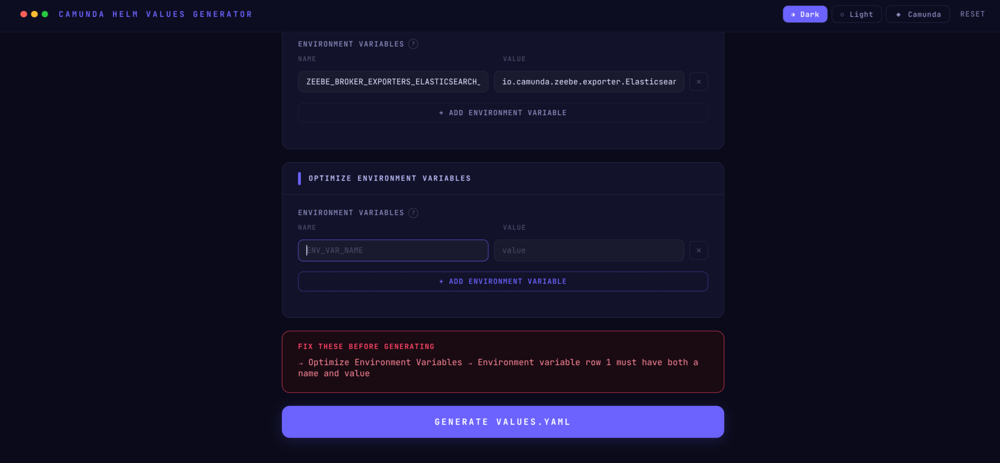
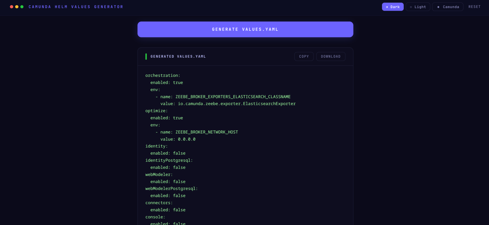
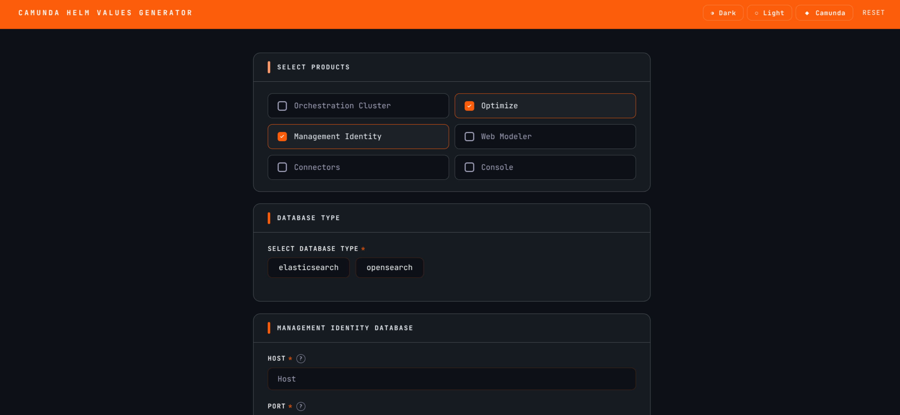
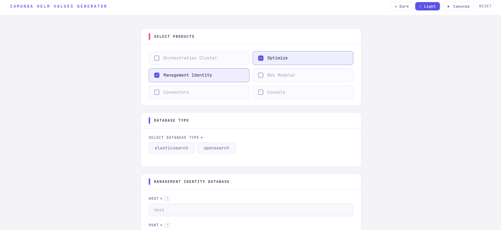

# Camunda Helm Values Generator

A web-based tool for generating `values.yaml` override files for deploying [Camunda Platform 8](https://camunda.com) on Kubernetes using Helm.

**Live demo:** [cphc-values-wizard.vercel.app](https://cphc-values-wizard.vercel.app/)

---

## The Problem

Deploying Camunda Platform 8 with Helm requires a `values.yaml` configuration file that can span hundreds of lines. It demands a detailed understanding of which fields to set, which to leave at defaults. A single misconfiguration can break the entire deployment.

## The Solution

Fill in a form. Get a correct, minimal `values.yaml`. Done.

The tool surfaces only the fields users actually need to configure, handles all implicit Helm requirements automatically, and outputs a file ready for use with `helm install`, without needing to understand the full chart structure.

---

## Features

- **Schema-driven UI** - the form builds itself from the official Camunda Helm chart values file. No fields are hardcoded
- **Conditional sections** - only relevant configuration appears based on product selection
- **Shared vs standalone database** - automatically shows the correct database section depending on which products are selected
- **Automatic Helm flags** - required values like `enabled`, `external`, and bundled database flags are set without user input
- **Environment variables** - dynamic per-product env var editor with name/value pairs
- **Field hints** - hover the `?` icon on any field to see its description pulled directly from the Helm chart
- **Three themes** - Dark, Light, and Camunda brand, persisted across sessions
- **Copy or download** - export your `values.yaml` directly from the browser

---

## Tech Stack

| Layer | Technology |
|---|---|
| UI | React 19 + Vite |
| YAML parsing & generation | js-yaml |
| Schema extraction | Node.js (build-time script) |
| Styling | CSS |

---

## Getting Started

### Prerequisites

- Node.js 18+
- npm

### Installation

```bash
git clone https://github.com/your-username/camunda-helm-values-generator
cd camunda-helm-values-generator
npm install
```

### Parse the Helm chart values

Extracts the schema from `values.yaml`. Run once on first setup, or whenever the chart version is updated:

```bash
npm run parse
```

### Start the development server

```bash
npm run dev
```

Open [http://localhost:5173](http://localhost:5173) in your browser.

---

## Usage

1. **Select products** - check the Camunda components you want to deploy
2. **Choose your database** - Elasticsearch or OpenSearch (shown only when relevant)
3. **Fill in connection details** - host, port, credentials
4. **Add environment variables** - optional, configured per product
5. **Generate** - click Generate, review any validation errors, then copy or download your `values.yaml`

---

## Project Structure
```
├── docs/
│   ├── architecture.md          Architecture and developer guide
│   └── screenshots/             UI screenshots
├── public/
│   └── values.yaml              Camunda Helm chart values (source of truth)
├── scripts/
│   └── parseValues.js           Build-time parser - extracts schema from values.yaml
├── src/
│   ├── schema.json              Generated schema - do not edit manually
│   ├── displayConfig.js         Controls which fields are shown and when
│   ├── transform.js             Converts form answers to Helm values object
│   ├── App.jsx                  React UI
│   ├── main.jsx                 Entry point
│   └── styles/
│       ├── theme.css            CSS variable definitions for all three themes
│       ├── global.css           Base reset and typography
│       └── components.css       All component styles
├── index.html
├── LICENSE
├── package.json
└── README.md
```

---

## Updating for a New Chart Version

1. Replace `public/values.yaml` with the new chart values file
2. Run `npm run parse` to regenerate `src/schema.json`
3. Review `src/displayConfig.js` - add any new fields that users need to configure
4. Commit both `public/values.yaml` and `src/schema.json`

---

## Extending the Tool

### Adding a new field

1. Open `src/schema.json` and search for the field by keyword to find its path
2. Add a field entry to the relevant section in `src/displayConfig.js`:

```javascript
{
  id: 'unique_id',
  path: 'the.exact.path.from.schema',
  label: 'Label shown to user',
  type: 'text',        // text | password | radio | checkbox | env_vars
  required: true
}
```

3. Save - the UI reflects the change automatically

### Adding a new section

Add a section object to the `sections` array in `src/displayConfig.js` with a `showIf` condition:

```javascript
{
  id: 'mySection',
  title: 'My Section Title',
  showIf: (answers) => answers.products.includes('myProduct'),
  fields: [ ... ]
}
```

The position of the section in the array determines its order in the UI.

---

## Screenshots






---

## Acknowledgements

Built on top of the foundation laid by the [Camunda Community Hub](https://github.com/camunda-community-hub).

---

## License

This project is licensed under the [MIT License](LICENSE).